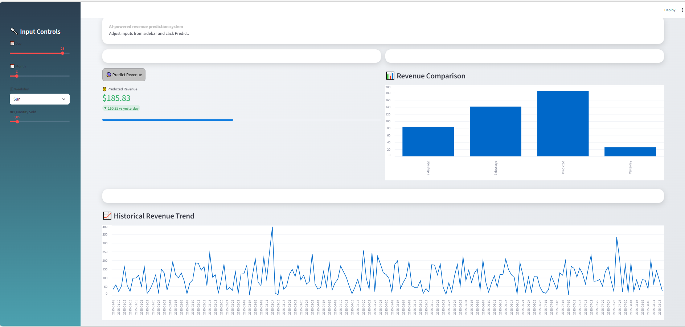

# 🍽 Restaurant Sales Forecasting Using Machine Learning

## Streamlit App Preview



## 📌 Project Overview

This project predicts **daily restaurant revenue** using machine learning based on transaction-level data.

The system uses historical order data to forecast future revenue, helping restaurants with:

* Sales forecasting
* Inventory planning
* Staff scheduling
* Business decision making

This is a complete **end-to-end ML project** including:

* Data preprocessing
* Feature engineering
* Model training
* Model evaluation
* Model saving
* Interactive Streamlit app

---

## 📂 Project Structure

```
Restaurant-Sales-Forecasting/

├── data/
│   ├── raw/
│   │   └── restaurant_orders.csv
│   └── processed/
│       └── daily_sales.csv

├── notebooks/
│   ├── 01_data_exploration.ipynb
│   ├── 02_feature_engineering.ipynb
│   ├── 03_modeling.ipynb
│   └── 04_evaluation_interpretation.ipynb

├── src/
│   ├── preprocessing.py
│   ├── feature_engineering.py
│   ├── modeling.py
│   └── evaluation.py

├── models/
│   └── final_model.pkl

├── reports/
│   ├── case_study.pdf
│   └── slides.pptx

├── app.py
├── requirements.txt
└── README.md
```

---

## ⚙️ Technologies Used

* Python
* Pandas
* NumPy
* Scikit-learn
* Matplotlib
* Seaborn
* Joblib
* Streamlit

---

## 🔧 Features Created

To improve prediction accuracy, advanced time-series features were created:

* Day
* Month
* Weekday
* Weekend indicator
* Lag features (Lag_1, Lag_2, Lag_3)
* Rolling averages (3-day, 7-day)
* Total quantity sold

These features significantly improve forecasting accuracy.

---

## 🤖 Machine Learning Model

Model used:

**Gradient Boosting Regressor**

Why?

* High accuracy
* Handles non-linear relationships
* Industry standard for forecasting tasks

---

## 📊 Model Performance

Evaluation metrics used:

* R² Score
* Mean Absolute Error (MAE)
* Mean Squared Error (MSE)

Achieved accuracy:

**R2: 0.7238030450065573**
**MSE: 1378.8354595467242**
**MAE: 29.16291888590945**

The following plot shows the comparison between actual and predicted sales revenue.

---

## 🚀 How to Run the Project

### Step 1: Clone repository

```
git clone https://github.com/Alisha4406/Restaurant-Sales-Forecasting.git
cd Restaurant-Sales-Forecasting
```

---

### Step 2: Install dependencies

```
pip install -r requirements.txt
```

---

### Step 3: Run notebooks in order

```
01_data_exploration.ipynb
02_feature_engineering.ipynb
03_modeling.ipynb
04_evaluation_interpretation.ipynb
```

---

### Step 4: Run Streamlit app

```
streamlit run app.py
```

---

## 💻 Streamlit App Features

* Interactive revenue prediction
* User input for date and quantity
* Real-time prediction
* Clean dashboard

---

## 📈 Business Impact

This system helps restaurants:

* Predict daily revenue
* Optimize inventory
* Reduce losses
* Improve planning

---

